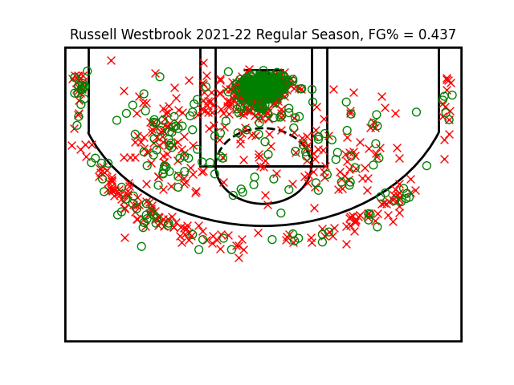
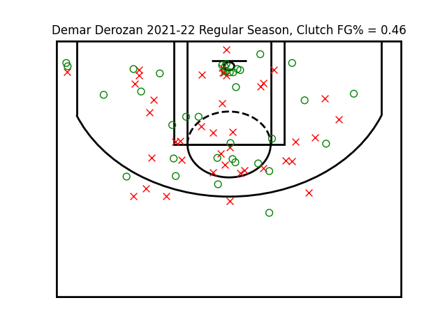

# NBA Shot Chart Builder

Project using matplotlib and data from nba.com to create shot charts for individual players for a specified season. Option to filter shots to those attempted in the final 3 minutes. Shot chart data only available from the 1996-97 season onwards. 

  

  

Shout out to Swar Patel for his API Client package to access APIs on NBA.com

https://github.com/swar/nba_api